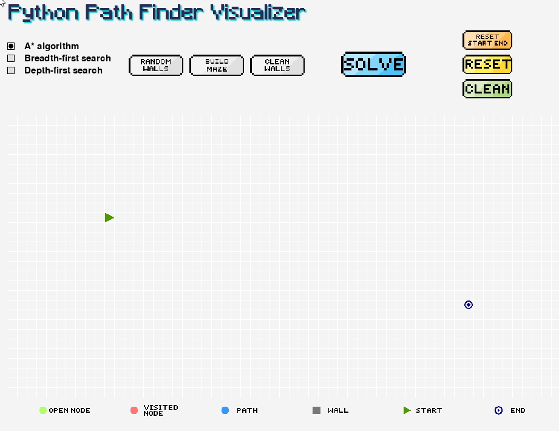
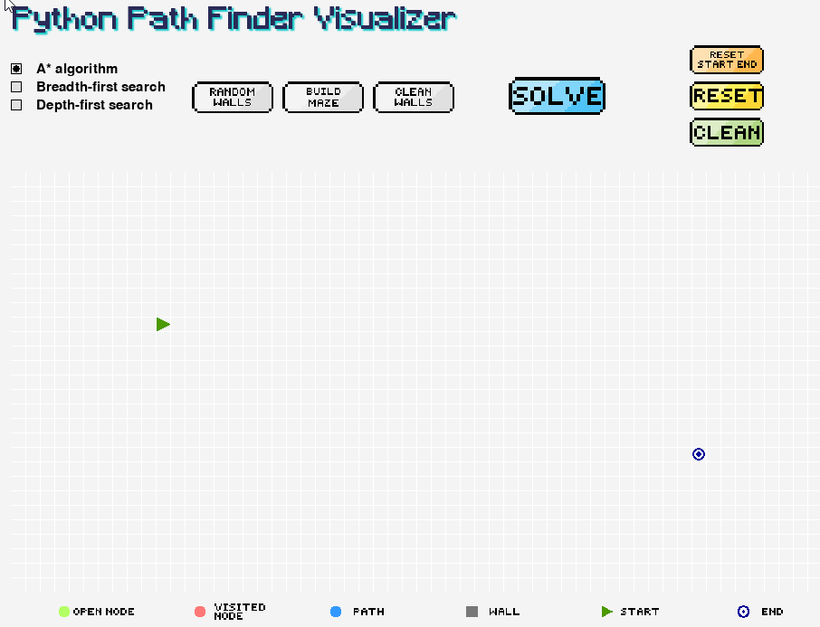
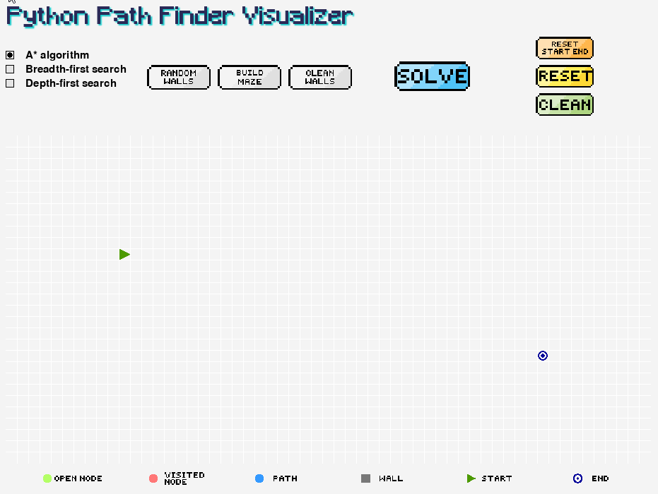

# Python Path Finder Visualizer

## Table of contents 
 * [Overview](#Overview)
 * [Installation](#Installation)
 * [How to use](#How-to-use)
 * [Helpful Links](#Helpful-Links)
 * [Contributing](#Contributing)
 
## Overview
This project is a path finder visualizer, fully coded in python with pygame. It features three different types of graph traversal algorithms and uses random recursive divisions for the maze generator.

## Installation
You can download the windows executable below:
<p align="left">
 <a href="https://github.com/aleolux/pythonPathFinderVisualizer/raw/main/exec/pythonPathFinderVisualizer.exe" target="_blank">
  
 </a>
<p>
Or download the source code and:

Install requirements using [pip](https://pip.pypa.io/en/stable/) and run:
```bash
$ pip install -r requirements.txt
$ python main.py
```

## How to use
 
- Pick and drop Start/End node by clicking a first time on it to pick it up, and a second time on the grid to drop it.
- Draw walls by left clicking on the grid
- Pick the algorithm of your choice and click "SOLVE" to visualize the path from the Start node to the target End node! 
 
<p align="left">
 
<p>
 
 
 
 
 - Use the "BUILD MAZE" button to generate a random maze
 
<p align="left">
 
<p>
 
 
 
 
- Use the "RANDOM WALLS" to generate a bunch of random walls on the grid
- Use "CLEAN" to clear the visited/unvisted nodes, "RESET" to reset the grid to its original state
  
<p align="left">
 
<p>
 
 

 
## Helpful Links
* [Wikipedia for A* algorithm](https://en.wikipedia.org/wiki/A*_search_algorithm)
* [Wikipedia for BFS](https://en.wikipedia.org/wiki/Breadth-first_search)
* [Wikipedia for DFS](https://en.wikipedia.org/wiki/Depth-first_search#:~:text=Depth%2Dfirst%20search%20(DFS),along%20each%20branch%20before%20backtracking)
* [Pygame basics tutorial on realpython.com](https://realpython.com/pygame-a-primer/)
* [pixilart.com (Website I used to design the buttons)](https://www.pixilart.com/)
* [Tech With Tim's video on A* algorithm in python](https://www.youtube.com/watch?v=JtiK0DOeI4A)
* [Jamis Buck's blog for maze generation](http://weblog.jamisbuck.org/2011/1/12/maze-generation-recursive-division-algorithm.html)

## Contributing
Pull requests are welcome. For major changes, please open an issue first to discuss what you would like to change.

Please make sure to update tests as appropriate.
 
- - -
© 2021 Adrien TIMBERT github.com/aleolux - All Rights Reserved.
